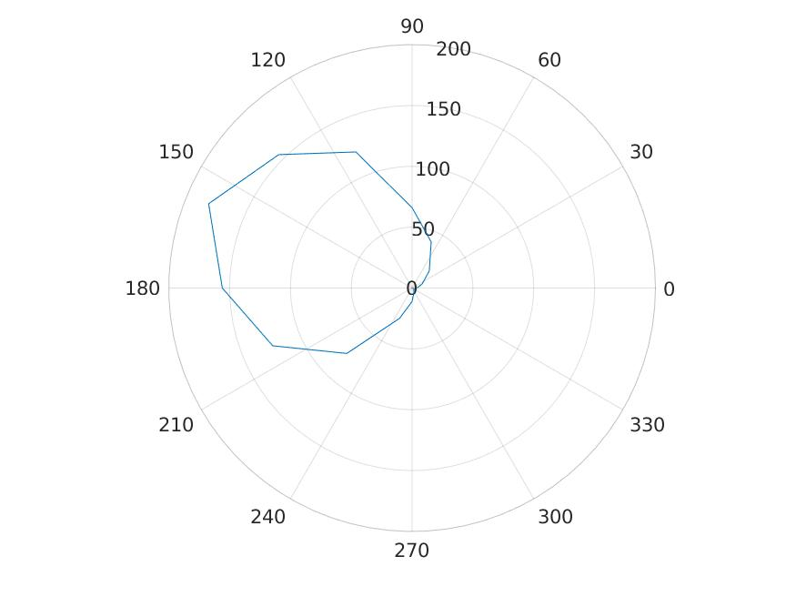

# Polar Plots

This repository tries to gather different methods for plotting *polar plots*, which should give the same results for different programming languages or plotting libraries.

## Plotting libraries
- Matlab
- Python
  - Seaborn (*Coming soon*)
  - Bokeh (*Coming soon*)
  - Plotly
  - Matplotlib
- R
  - ggplot

## Dataset

We decided to use a very simple copy and paste dataset which was created from a gaussian distribution.
```
theta = [0,0.3927,0.7854,1.1781,1.5708,1.9635,2.3562,2.7489,3.1416,3.5343,3.9270,4.3197,4.7124,5.1051,5.4978,5.8905,6.2832]
rho = [4,9,20,41,66,121,155,181,156,124,76,27,11,4,2,2,1]
```
Most of the datasets used are likely more complex than this, but here we just want to give a minimal example of the plotting functions for different languages.

## Results

Matlab             |  Python Matplotlib
:-------------------------:|:-------------------------:
  |  

Seaborn           |  R
:-------------------------:|:-------------------------:
  |  

Just placeholders except for Matlab. Go ahead Nacho and contribute! ;) 

## Code Snippets for creation of Test Data
```
--> Matlab
theta = 0:pi/8:2*pi;
rho = histcounts(normrnd(0,1,1000,1), 17);
```
```
--> Python
...
```
```
--> R
...
```

## Contribution
Please provide a documented function for your language which takes a minimum of three inputs :
- theta
- rho
- save

where save is boolean and specifies if result should be plotted directly (save=False) or saved to file (save=True).
